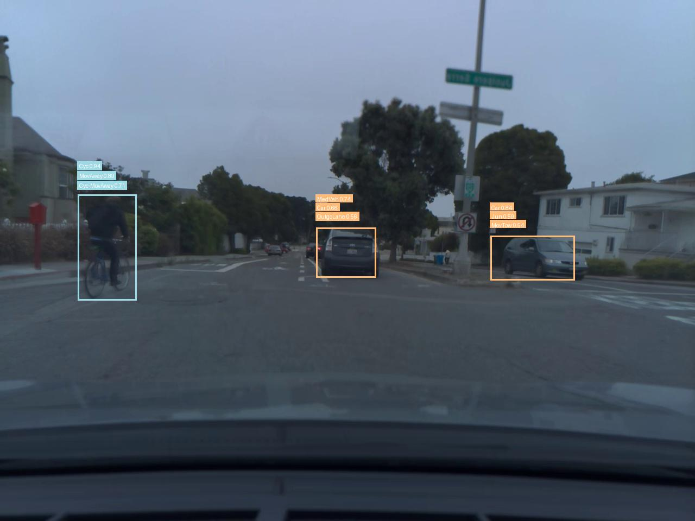

# 3D-RetinaNet for comma2k19 inference
This repository contains code for **3D-RetinaNet**, a single-stage action detection network originally proposed along with the [ROAD dataset](https://github.com/gurkirt/road-dataset).  
Detailed descriptions of 3D-RetinaNet and the ROAD dataset can be found in the [TPAMI paper](https://www.computer.org/csdl/journal/tp/5555/01/09712346/1AZL0P4dL1e).  

In this implementation, we extend 3D-RetinaNet to perform **inference and tube building** for the unlabeled [comma2k19 dataset](https://github.com/commaai/comma2k19?tab=readme-ov-file), after training on ROAD.  
This enables the extraction of structured concepts (agents, actions, locations and interactions) from raw driving sequences, which can then be used in downstream tasks such as action prediction.

---

## Table of Contents
- <a href='#requirements'>Requirements</a>
- <a href='#preprocessing-flip-comma2k19-images'>Preprocessing: Flip Comma2k19 Images</a>
- <a href='#inference-and-tube-building-for-comma2k19'>Inference and Tube Building for comma2k19</a>
- <a href='#output-concept-extraction'>Output: Concept Extraction</a>
- <a href='#qualitative-visualization'>Qualitative Visualization</a>
---

## Requirements

To run inference you will need **PyTorch**, **torchvision**, **tensorboardX**, trained weights, and the comma2k19 dataset.  

### PyTorch and Weights
- Install [PyTorch](https://pytorch.org/) and [torchvision](http://pytorch.org/docs/torchvision/datasets.html)  
- Install tensorboardX via:
    `
      pip install tensorboardx
    `
- Download the trained weights on ROAD from this [Google Drive link](https://drive.google.com/drive/folders/1yrzf1VKscOlysXxKDh4N_6uRvt8-dxa-)
  - Place the weights inside the following path:
  `
  {SAVE_PATH}/comma/cache/resnet50I3D512-Pkinetics-b4s8x1x1-commat3-h3x3x3/
  `

### Dataset download 

We currently support inference of [comma2k19 dataset](https://github.com/commaai/comma2k19?tab=readme-ov-file) originally presented in this [paper](https://arxiv.org/pdf/1812.05752v1).

Since inference relies on concepts learned from ROAD, you must also download the ROAD training/validation JSON file:
  - [road_trainval_v1.0.json](https://drive.google.com/drive/folders/1hCLlgRqsJBONHgwGPvVu8VWXxlyYKCq-)

After installing the dataset and the JSON file, data directory should look like:

  ```bash
  - {DATASET_PATH}/
      - comma/
          road_trainval_v1.0.json
          - rgb-images/
                - comma-video-name-1/
                    - images ......
                - comma-video-name-2/
                    - images ......
                ....
  ```


## Preprocessing: Flip Comma2k19 Images

Since **3D-RetinaNet** was trained on **ROAD** (collected in the UK, left-hand driving), to run inference on **comma2k19** (collected in the US, right-hand driving) the dataset could be **flipped left-to-right** before running inference, to largely improve accuracy.  
A utility script is provided for this:

```bash
python utils/flip_left_right.py --input_root {PATH_TO_COMMA2K19} \
                                --output_root {PATH_TO_FLIPPED_COMMA2K19}
```

This ensures consistent alignment between the training and inference domains.

After flipping, all subsequent inference steps should use the `{PATH_TO_FLIPPED_COMMA2K19}` folder as input.


## Inference and Tube Building for comma2k19
We assume that you have downloaded the dataset and trained weights and placed them in the correct locations.

### Running Inference

To run inference, use the main script `main.py` and specify parameters via flags. The mode `--MODE=extract_concepts` must be used to generate concept logits and tubes.

Example run:

```bash
python main.py \
{DATASET_PATH} \
{SAVE_PATH} \
--DATASET=comma --MODE=extract_concepts \
--TEST_SEQ_LEN=8  \
--TEST_BATCH_SIZE=2 --NUM_WORKERS=4 
```

### Demo on Kaggle

For convenience, we provide a Jupyter Notebook [`demo_run.ipynb`](./demo_run.ipynb) that demonstrates how to run inference on the **comma2k19** dataset using the Kaggle platform.

### Notes on Inference

- **Concept logits**: For each frame, 3D-RetinaNet outputs bounding boxes and per-concept logits.  
- **Tube building**: Detections across frames are linked into *tubes*, which represent the temporal evolution of objects and actions. Tubes are essential for modeling driving events, as they preserve both spatial and temporal continuity.  
- **Pooling**: For downstream use, logits are aggregated using **max pooling** across detections per frame, yielding a compact representation of size `1 × n` per frame (where `n` = number of concepts).  

## Output: Concept Extraction

When running inference with **3D-RetinaNet**, the pipeline produces both **frame-level** and **video-level** outputs that can be reused for downstream tasks (e.g., GridLock integration).

### Frame-level outputs
- For each frame, we save a `.pkl` file containing:
  - **Ego predictions** (driver-related states)
  - **Detections** (bounding boxes + per-concept logits)
  - **Concept labels** (textual names of ROAD concepts)
- These files are organized under:
  `concepts-<epoch>-<seq_len>/<video_name>/<frame_id>.pkl`

### Video-level outputs
- After processing all frames, we reconstruct **full 240-frame videos** into compact tensors:
- Stored under:
  `
  batch_concepts-<epoch>-<seq_len>/<video_name>.pt
  `
- Each `.pt` file contains:
  - `concepts`: tensor of shape `[240, num_concepts]`
  - `video_name`: original video identifier
  - `video_id`: dataset index
  - `total_frames`: always 240 for complete videos
  - `num_concepts`: number of concepts
  - `textual_concepts`: mapping of indices → concept names
  - `frame_coverage`: number of frames successfully reconstructed

### Incomplete videos
- If a video does not reach the full 240 frames (e.g., due to missing detections), a truncated tensor is still saved:
`batch_concepts-<epoch>-<seq_len>/<video_name>incomplete<num_frames>frames.pt`

- These files additionally contain:
- `missing_frames`: set of frame indices not reconstructed.

---

This structured output provides:
- **Rich frame-level information** for fine-grained analysis.  
- **Compact video-level representations** for concepts modeling, useful for downstream tasks in driving scenarios.


## Qualitative Visualization

To inspect the results, you can visualize the detected tubes (spatio-temporal trajectories of objects and actions) on the original frames.
This is done using the script:

```bash
python utils/plot_tubes.py \
    --tube_file path/to/tubes.pkl \
    --videoname {INPUT_VIDEO_FOLDER} \
    --frames_root path/to/comma/rgb-images \
    --out_root {OUTPUT_FOLDER}
```

**What** plot_tubes.py **does**:
- Loads the **tube predictions** (bounding boxes + concept scores across time).
- Draws **bounding boxes** and **labels** for the top-k concepts per frame.
- Uses deterministic coloring so the same concepts always appear with the same color.
- Preserves spatial and temporal continuity by grouping detections into **tubes**.
- Outputs annotated frames in the specified folder.

You can then reconstruct a video for qualitative inspection, for example:

```bash
ffmpeg -framerate 10 -i {OUTPUT_FOLDER}/%05d.jpg OUTPUT_VIDEONAME.mp4
```

This produces a video where road events are clearly visualized as evolving tubes across time, as shown in [plotted_road_events.mp4](./qualitative_results/plotted_road_events.mp4).

---

Below is a sample visualization of detections generated by 3D-RetinaNet on comma2k19:

